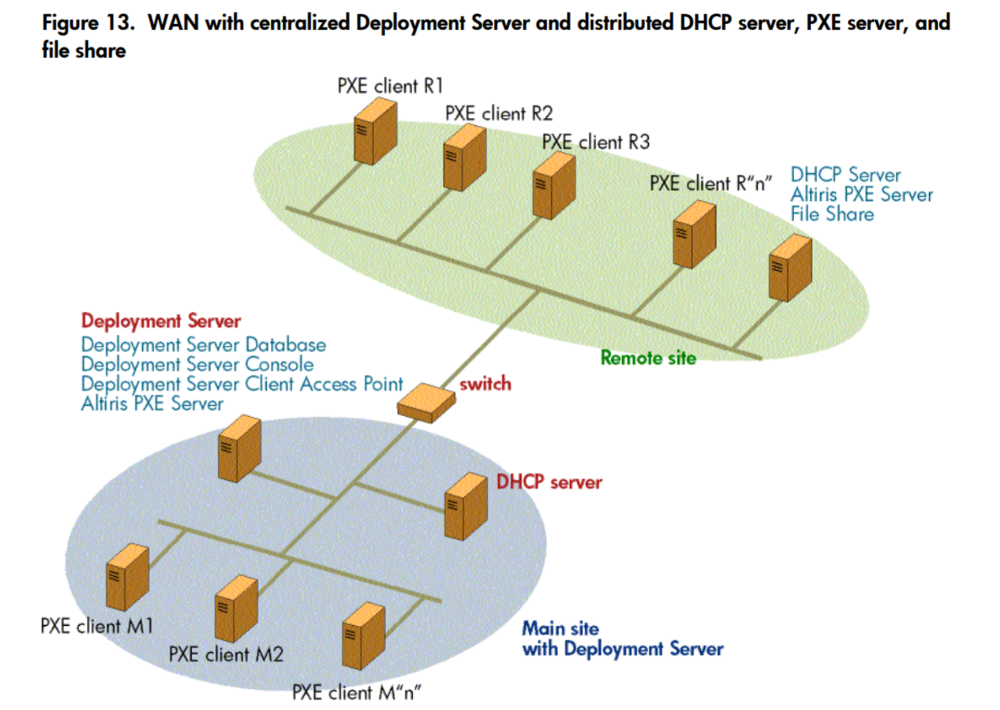
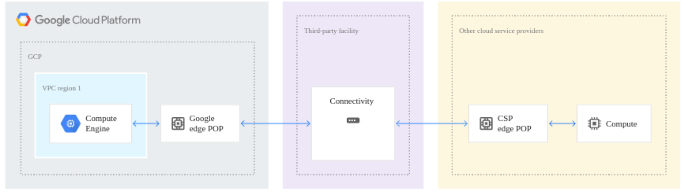

# Infrastructure

Maintenant que nous avons examiné les services proposés dans le cloud, plongeons-nous dans l'aspect fondamental de l'infrastructure. L'infrastructure dans le cloud va bien au-delà des services individuels; elle englobe la conception, la création et le déploiement de l'environnement qui supporte l'ensemble de vos opérations numériques. Dans ce cours, nous allons explorer en détail les différents aspects de l'infrastructure dans le cloud, en mettant l'accent sur sa conception, sa gestion et son déploiement.

## Conception de l'Infrastructure:

La conception de l'infrastructure dans le cloud est une étape cruciale qui nécessite une planification minutieuse. Elle commence par une analyse approfondie des besoins et des exigences de votre entreprise. À partir de là, vous pouvez commencer à concevoir l'architecture de votre infrastructure, en identifiant les composants clés tels que les réseaux, les serveurs, le stockage et les services supplémentaires nécessaires pour répondre à vos objectifs.

## Schématisation de l'Infrastructure:

La schématisation de l'infrastructure consiste à représenter visuellement la disposition des composants matériels et logiciels, ainsi que leurs interconnexions. Les diagrammes d'infrastructure offrent une vue d'ensemble claire de la manière dont tous les éléments de votre environnement cloud s'imbriquent, facilitant ainsi la compréhension et la planification de votre infrastructure.

## Création de l'Infrastructure:

Une fois la conception et la schématisation terminées, vous pouvez passer à la création de votre infrastructure dans le cloud. Cela implique de configurer et de provisionner les ressources nécessaires en fonction des spécifications définies lors de la phase de conception. Cette étape peut inclure la création de machines virtuelles, la configuration du réseau, le provisionnement du stockage et d'autres tâches similaires.

## Gestion de l'Infrastructure:

La gestion de l'infrastructure dans le cloud est un processus continu qui comprend la surveillance, la maintenance et l'optimisation de vos ressources. Vous devrez surveiller les performances de votre infrastructure, gérer les mises à jour et les correctifs, ainsi que prendre des mesures pour optimiser les coûts et améliorer l'efficacité opérationnelle.

## Déploiement de l'Infrastructure:

Une fois que votre infrastructure est prête, vous pouvez procéder au déploiement de vos applications et services. Cela implique de déployer vos applications sur les serveurs configurés, de configurer les connexions réseau nécessaires et de tester l'ensemble du système pour vous assurer qu'il fonctionne comme prévu.

## Exemple

Dans un environnement PXE (Preboot Execution Environment), l'infrastructure joue un rôle crucial dans le démarrage des systèmes d'exploitation à partir d'un serveur distant. Le PXE permet aux ordinateurs clients de se connecter au réseau et de charger un système d'exploitation via le réseau, plutôt que depuis un support de stockage local tel qu'un disque dur ou un disque optique. Comme le montre l'illustration ci-dessous: 

Vous trouverez les detaille concernant cette image [ici](https://h10032.www1.hp.com/ctg/Manual/c00257503.pdf)
  

GCP vous propose une solution clé en main pour concevoir et déployer une infrastructure cloud interconnectée, éliminant les silos et favorisant une collaboration fluide entre vos différents environnements cloud.

Vous trouverez les detaille concernant cette image [ici](https://cloud.google.com/architecture/patterns-for-connecting-other-csps-with-gcp?hl=fr)
  
Pour conclure l'infrastructure dans le cloud est le fondement sur lequel reposent toutes vos opérations numériques. En comprenant les principes de conception, de schématisation, de création, de gestion et de déploiement de l'infrastructure dans le cloud, vous serez en mesure de créer et de gérer des environnements cloud robustes et évolutifs qui répondent aux besoins de votre entreprise.