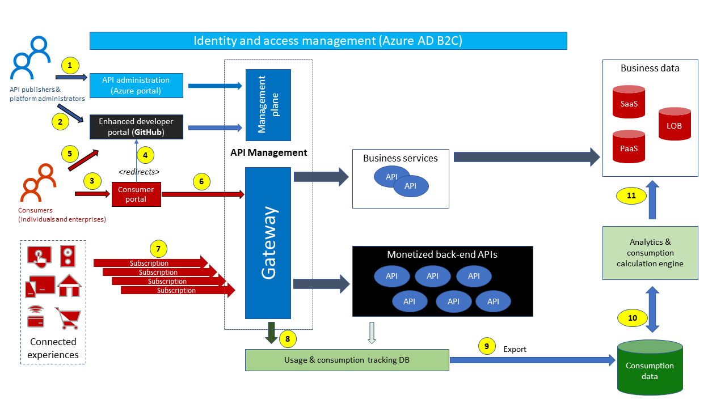
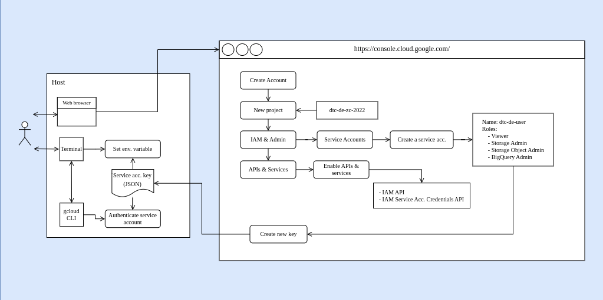

# L'infrastructure As Code

## Mecanisme de deploiement Iac

Dans cet environnement, le déploiement des ressources sur le cloud s'opère à travers l'Infrastructure as Code (IaC). Avant tout déploiement, la configuration des secrets associés à votre compte utilisateur dédié est nécessaire, notamment les identifiants d'authentification et les clés d'accès. Une fois authentifié avec les autorisations appropriées, ces informations permettent de déployer et de gérer les ressources fournies par le fournisseur de cloud.

Le mécanisme de déploiement IaC implique la description de l'infrastructure souhaitée dans des fichiers de configuration. Ces fichiers sont ensuite interprétés par des outils tels que des CLI (Command Line Interface) ou des modules comme Ansible. Ils effectuent des appels API vers le fournisseur de cloud pour créer, configurer ou supprimer les ressources selon les spécifications définies.

Chaque requête, qu'elle soit effectuée via des appels API ou par le biais de modules Ansible, nécessite une négociation avec le fournisseur de cloud. Cette négociation comprend l'échange de données d'authentification et l'établissement d'une session sécurisée pour garantir un accès autorisé aux ressources et une manipulation sécurisée des données.

Les diagrammes illustrant la négociation entre vos informations d'identification et le fournisseur cloud mettent en lumière cette phase cruciale du déploiement. Ils soulignent les échanges de données et les mécanismes de sécurité mis en place pour assurer un déploiement fiable et sécurisé dans le cloud.

    

 
 

## Git pour l'IaC

Dans le domaine de l'Infrastructure as Code (IaC), Git joue un rôle crucial. En tant qu'outil de gestion de version, il assure la traçabilité et la fiabilité des opérations liées à l'infrastructure et au système. Grâce à ses fonctionnalités telles que les branches et les pull requests, Git facilite la collaboration et la gestion des changements. Son intégration dans les processus opérationnels permet d'automatiser les tâches récurrentes et d'assurer la cohérence de l'infrastructure déployée. En fournissant une visibilité complète sur l'évolution de l'infrastructure, Git permet de suivre les modifications et de garantir la conformité aux normes et aux bonnes pratiques. En résumé, Git est un pilier essentiel de l'IaC, offrant stabilité, fiabilité et efficacité aux opérations d'administration système et d'infrastructure.