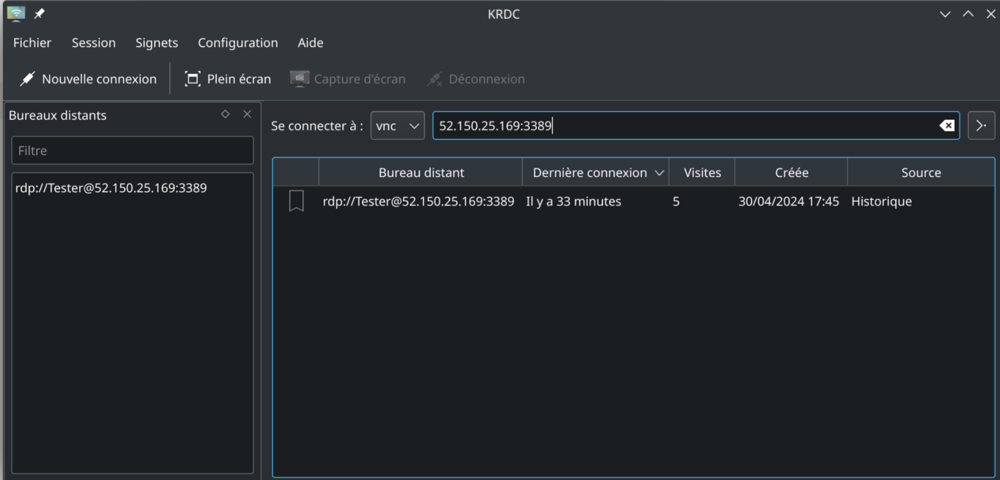

# Acceddez a votre vm en rdp

Si votre script est deployer avec succes vous avec access a votre vm via rdp avec docker de preinstaller

## 1. Docker installation

```bash
Doc: https://learn.microsoft.com/en-us/virtualization/windowscontainers/quick-start/set-up-environment?tabs=dockerce
Lien: https://raw.githubusercontent.com/microsoft/Windows-Containers/Main/helpful_tools/Install-DockerCE/install-docker-ce.ps1
```

## 2. VNC remote connection



<br/>

