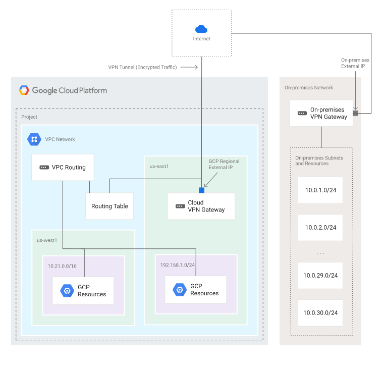
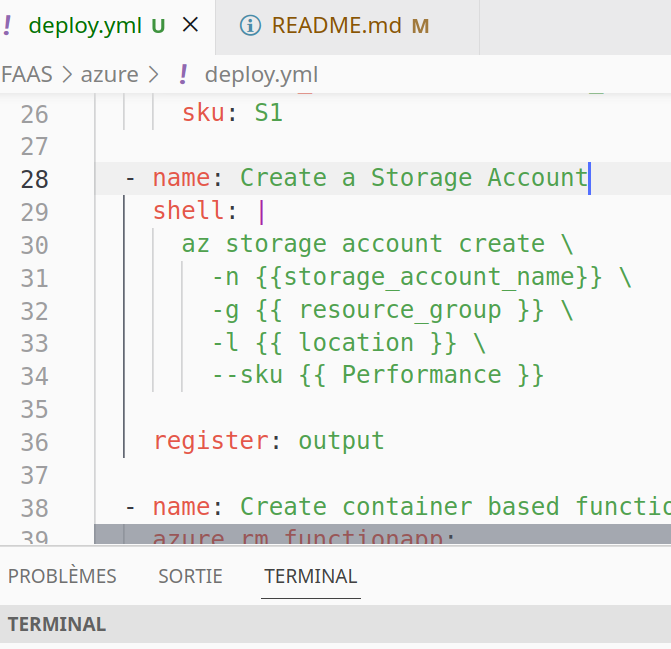
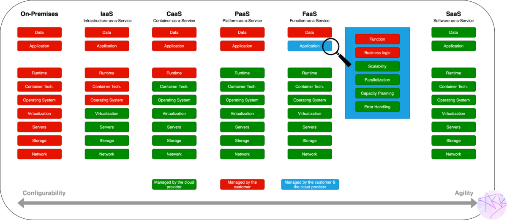
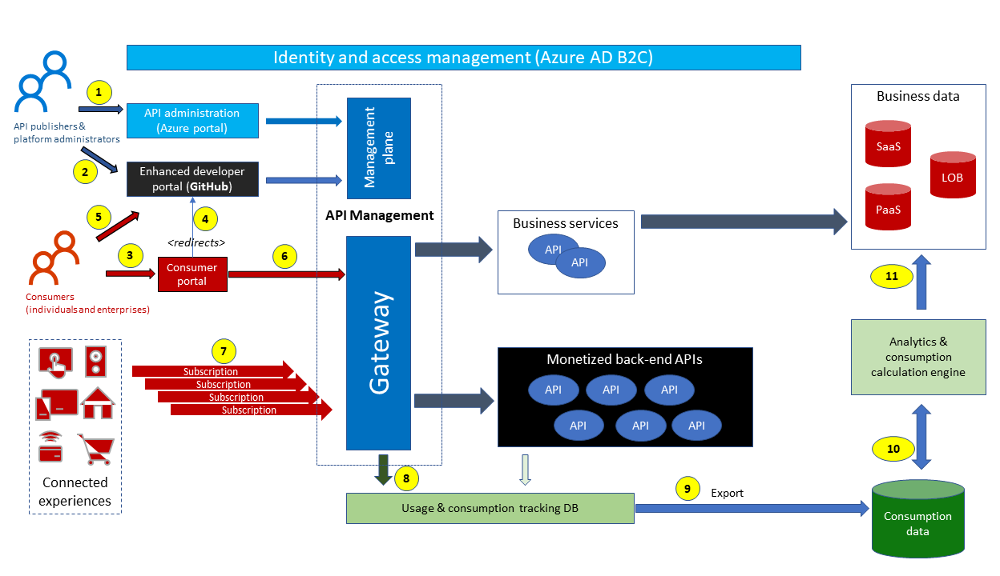
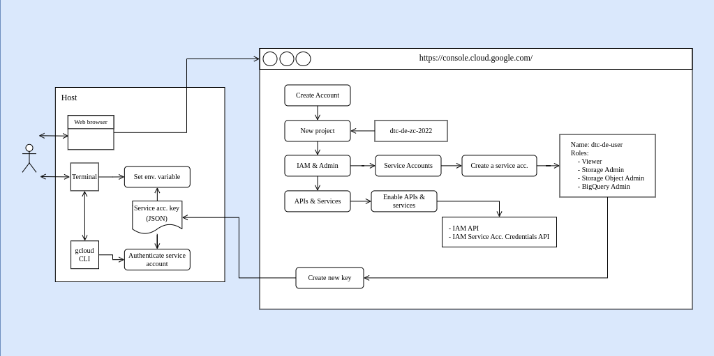

# Cloud Supdevinci baschelor 3 2024

## Infrastructure

[Redhat](https://www.redhat.com/en/topics/cloud-computing/what-is-it-infrastructure): Les infrastructures de technologie de l'information (IT) sont les composants nécessaires pour faire fonctionner et gérer environnements IT d'entreprise. 

Il sont generalement decris sous forme de schema appellé aussi diagramme.  Les schémas ou diagrammes des infrastructures informatiques permettent de visualiser la disposition des composants matériels et logiciels, ainsi que leurs interconnexions. Cette représentation visuelle est cruciale pour comprendre la structure et le fonctionnement de l'infrastructure, facilitant ainsi la planification, la gestion et la prise de décision. En effet, en observant un tel diagramme, les professionnels de l'IT peuvent rapidement identifier les points de congestion, les éventuels goulets d'étranglement et les zones de vulnérabilité, ce qui leur permet de mettre en œuvre des solutions adaptées pour optimiser les performances et renforcer la sécurité du système.

Exemple: Ce schéma représente une connexion VPN classique entre votre réseau d'entreprise et le service cloud. Il met en évidence la liaison sécurisée établie par les tunnels VPN IPsec entre les hôtes sur site et les instances de machines virtuelles dans le cloud. Cette infrastructure assure une connectivité fiable et chiffrée, permettant un accès sécurisé aux ressources cloud depuis le réseau local de l'entreprise. [En savoir plus](https://cloud.google.com/network-connectivity/docs/vpn/concepts/classic-topologies?hl=fr)



## Transition vers l'Infrastructure as Code (IaC)

La transition vers l'Infrastructure as Code (IaC) est une évolution logique dans la gestion des infrastructures informatiques. Avant cette approche, la gestion des ressources impliquait souvent des processus manuels sujets à des erreurs et à des retards. L'IaC offre une alternative radicalement différente en représentant les ressources système sous forme de code, ce qui permet une automatisation et une reproductibilité accrues.

L'un des avantages les plus évidents de l'IaC est la possibilité de versionner l'infrastructure, ce qui facilite la collaboration entre plusieurs intervenants et permet de suivre en temps réel l'évolution du système. L'utilisation d'outils de versionnement comme Git devient donc indispensable pour garantir la cohérence et la fiabilité de l'infrastructure.

Dans cette transition vers l'IaC, l'importance de ne pas compter sur une image mentale de l'infrastructure devient évidente. L'image mentale est sujette à des erreurs de mémoire, à des oublis et à des interprétations subjectives. En revanche, un script Ansible représentant la configuration des ressources offre une alternative concrète et reproductible. Il contient des données précises et exploitables qui peuvent être réutilisées, modifiées et déployées de manière cohérente.

Pour illustrer cette différence, examinons deux photos : l'une montrant une configuration manuelle de ressources et l'autre un script Ansible représentant cette même configuration. Bien que les données semblent similaires dans les deux cas, il est clair que l'une est une simple image non exploitable, tandis que l'autre est un script personnalisable et reproductible. 
S'appuyer sur une image mentale pour gérer les infrastructures comporte ses limites et ses pièges, conduisant souvent à des erreurs, des omissions et des incohérences. En adoptant Infrastructure as Code, les organisations peuvent atténuer ces risques et rationaliser leurs opérations grâce à une approche plus fiable et automatisée de la gestion de l'infrastructure.




<br/>
<br style="clear:both"/>


## Cloud Privé vs Cloud Public

Lorsque vous explorez les options de cloud computing, il est important de connaître les différentes possibilités qui s'offrent à vous. Si vous souhaitez avoir un contrôle total sur votre infrastructure cloud, des solutions comme [OpenStack](https://docs.openstack.org/2024.1/install/) permettent de déployer votre propre cloud privé. Cependant, cela signifie que vous devrez assumer la responsabilité du provisionnement manuel des ressources lorsque votre infrastructure atteint ses limites physiques. Il est crucial d'anticiper cette situation pour éviter tout impact sur les processus en cours, comme les temps d'attente pour les processus de construction et la perte d'artefacts. La gestion manuelle des ressources offre une flexibilité accrue, mais nécessite une surveillance et une planification constantes pour maintenir des performances optimales. L'intégration d'outils tels que [Node Exporter](https://github.com/grafana/grafana), [Grafana](https://github.com/prometheus/node_exporter), [AlertManager](https://github.com/prometheus/alertmanager) et [Prometheus](https://github.com/prometheus/node_exporter) permet d'ajouter un système de monitoring et d'alerting à votre infrastructure, ce qui vous permet d'anticiper les besoins en ressources de votre cloud privé.


## Les services cloud (Iaas,Paas,Faas,Caas) proposé par GCP, Azure et Aws

Intro: L'externalisation de l'infrastructure informatique : l'objectif central des providers cloud

Cette externalisation présente de nombreux avantages pour les entreprises, dont les plus importants sont :

1. Réduction des coûts:

    
    Le cloud computing offre une flexibilité et une évolutivité significatives, permettant aux entreprises de réduire les investissements initiaux, d'optimiser les dépenses opérationnelles et d'éliminer les frais de maintenance. Cependant, pour les petites infrastructures avec des besoins stables et prévisibles, l'achat d'un serveur dédié peut être une alternative plus rentable, offrant un contrôle total sur les coûts et les mises à niveau. Chaque entreprise doit évaluer attentivement ses besoins spécifiques en infrastructure pour choisir la solution qui lui convient le mieux en termes de coûts, de performances et de contrôle. [Voir les cout sur le cloud](./aDocumentation/GestionDesCouts/README.md)

2. Flexibilité et évolutivité :

    Notre système offre une adaptabilité rapide aux changements d'activité, permettant une augmentation ou une réduction des ressources en quelques clics pour répondre aux besoins fluctuants. Cela évite les problèmes de sous-dimensionnement ou de surdimensionnement en assurant un accès à la juste quantité de ressources au bon moment. De plus, la gestion des pics d'activité est simplifiée, ce qui permet une anticipation et une gestion aisée des périodes de forte demande.

3. Accessibilité et disponibilité :

    Accès aux données et applications depuis n'importe où: Travail à distance, collaboration facilitée et meilleure productivité. Disponibilité 24/7: Infrastructures cloud redondantes pour une continuité de service optimale. Réduction des risques de pannes et perte de données: Expertise et technologies de pointe pour une sécurité renforcée.

4. Innovation et expertise :

    Accès aux dernières technologies cloud: Bénéficier des innovations et mises à jour constantes pour rester à la pointe du progrès. Se concentrer sur son cœur de métier: Déléguer l'infrastructure informatique à des spécialistes pour se concentrer sur les activités stratégiques. Profiter de l'expertise des providers cloud: Accéder à des conseils et à une assistance de qualité pour optimiser l'utilisation du cloud.


### Presentation: IaaS, PaaS, SaaS, CaaS et FaaS dans GCP et Azure

Le cloud computing offre une multitude de modèles de service pour répondre aux besoins variés des utilisateurs, chacun proposant un niveau d'abstraction et de gestion des ressources distinct. Explorons ces modèles et leur déclinaison dans les plateformes cloud majeures, Google Cloud Platform (GCP) et Microsoft Azure.



### On-Premise

On-Premise represente votre solution cloud privé et ses modele de services pré-implementé notamment chez [OpenStack](https://www.openstack.org/) ou encore [OpenFass](https://www.openfaas.com/)

### IaaS (Infrastructure as a Service):

Avec IaaS, vous louez des ressources informatiques fondamentales telles que des serveurs virtuels, du stockage, du réseau et des systèmes d'exploitation. Vous bénéficiez d'un contrôle total sur ces ressources, mais devez gérer vous-même la configuration, la maintenance et la sécurité.

GCP: Compute Engine, Google Cloud Storage, Google Cloud VPC et Google Kubernetes Engine sont des exemples de services IaaS proposés par GCP.

Azure: Azure Virtual Machines, Azure Blob Storage, Azure Virtual Network et Azure Kubernetes Service sont les équivalents IaaS d'Azure.

### PaaS (Platform as a Service):

PaaS offre aux développeurs une plateforme préconfigurée pour le développement, le déploiement et l'exécution d'applications. Le PaaS s'occupe de la gestion de l'infrastructure sous-jacente, permettant aux développeurs de se concentrer sur la création d'applications.

GCP: App Engine, Google Cloud Functions et Google Kubernetes Engine (en mode PaaS) sont des exemples de services PaaS proposés par GCP.

Azure: Azure App Service, Azure Functions et Azure Kubernetes Service (en mode PaaS) sont les équivalents PaaS d'Azure.

### SaaS (Software as a Service):

SaaS offre aux utilisateurs des applications logicielles hébergées et gérées par le fournisseur de cloud. Vous accédez aux applications via un navigateur web ou une API, sans avoir à les installer ou à les gérer vous-même.

GCP: Google Workspace, G Suite, et Salesforce sont des exemples d'applications SaaS populaires exécutées sur GCP.

Azure: Microsoft 365, Dynamics 365 et Adobe Creative Cloud sont des exemples d'applications SaaS populaires exécutées sur Azure.

### CaaS (Container as a Service):

CaaS fournit aux développeurs une plateforme pour déployer et exécuter des applications conteneurisées. Les conteneurs sont des unités d'application légères et autonomes qui incluent tout le nécessaire pour s'exécuter, y compris le code, les bibliothèques et les dépendances.

GCP: Google Kubernetes Engine (en mode CaaS) et Anthos Config Management sont des exemples de services CaaS proposés par GCP.

Azure: Azure Kubernetes Service (en mode CaaS) et Azure Container Instances sont les équivalents CaaS d'Azure.

### FaaS (Function as a Service):

FaaS permet aux développeurs d'exécuter des fragments de code, ou fonctions, sans avoir à gérer l'infrastructure ou les serveurs. Vous payez uniquement pour les ressources utilisées lors de l'exécution de vos fonctions.

GCP: Google Cloud Functions est le principal service FaaS proposé par GCP.

Azure: Azure Functions est l'équivalent FaaS d'Azure.

Choisir le bon modèle de service cloud :

Le choix du modèle de service cloud approprié dépend de plusieurs facteurs, tels que les besoins spécifiques de l'utilisateur, le niveau de contrôle et de flexibilité requis, et les compétences techniques disponibles.

## Mecanisme de deploiement Iac

Dans cet environnement, vous configurez les secrets associés à votre compte utilisateur dédié au déploiement. Une fois authentifié avec les bonnes autorisations associées à votre profil, vous pouvez manipuler toutes les ressources fournies par votre fournisseur de cloud. Que ce soit par le biais d'appels API effectués par votre CLI ou par le module Ansible associé, vous effectuez dans tous les cas une requête nécessitant cette négociation.

Exemple sur azure and gcp:






<br/>
<br style="clear:both" />


### Ansible

Utilisé les modules [azure](https://docs.ansible.com/ansible/latest/collections/azure/azcollection/index.html) et [gcp](https://docs.ansible.com/ansible/latest/collections/google/cloud/index.html) et n'hesitez pas a utilisé la cli via le module 'shell' ansible des providers cloud [gcp](https://cloud.google.com/sdk/docs/scripting-gcloud?hl=fr) at [azure](https://learn.microsoft.com/fr-fr/cli/azure/reference-index?view=azure-cli-latest) pour des besoin plus fin.

### Comment deployer vos script Ansible ?

`Docker` et `Make` sont les seuls dependance necessaire sur votre systeme ! [Voir les pre-requis](./aDocumentation/Requirements/README.md)

Le Makefile disponible à la racine de chaque projet permet l'utilisation facile des CLIs cloud et des modules Ansible sans nécessiter de téléchargement supplémentaire. Tout est pré-embarqué dans un conteneur Docker, simplifiant ainsi le déploiement des services cloud sans aucune manipulation supplémentaire de la part de l'utilisateur final.

[Tout au sujet du Makefile](./aDocumentation/UseMakefileToDeploy)

```bash
Service proposé par les providers cloud gcp et azure
CLOUD_PROVIDERS_SERVICES
├── README.md
├── services_name
│   ├── Makefile 
│   ├── deploy.yml
│   └── ...
```

1. Fonctionnement:

Le Makefile démarre un conteneur Docker en arrière-plan contenant les modules d'identification et de connexion aux API pour GCP et Azure. Ce conteneur reste actif uniquement pendant l'exécution du script Ansible, ce qui limite son impact sur le système. Cela vise à minimiser la durée de vie des variables d'environnement dans le système pendant le déploiement.

Normalement vous devrez allez a la racine du ficher services_name generalement nommé chez moi comme une offre de service cloud. Par la suite vous devrez dans chaque repo tapez `make deploy_${cloud_provider}_${service_name}` ou pour les exercices `make deploy_${cloud_provider}_exo_${service_name}`. example: `make deploy_gcp_caas` or `make deploy_azure_faas`

2. Configuration

Remplacer le '.env.example' et renommez le en '.env' dans chaque dossier ouvous verrer ce fichier
ajoutez-y vos credentials azure student

Pour les deploiement azure:

```bash
email: bdx-XX@...
password: myPass
```

Pour les deploiement gcp:

```bash
GCP_PROJECT_NAME=#Your project id
SERVICE_ACCOUNT_PRIVATE_KEY_JSON=/workdir/account/my-account.json #Default path to your api secret key
SERVICE_ACCOUNT_NAME=#Name of your service account
```


## Approfondissez vos connaissances avec des cours en ligne et des vidéos.

```yaml
Openstack:
- Description: 'Hebergé votre propre Cloud'
- Presentation: 'https://www.youtube.com/watch?v=BmwgKF5Jc0g'
- Documention: 'https://docs.openstack.org/2024.1/install/'
- Infrastructure:
    Tacker:
        description: 'Tacker est un outil dans OpenStack qui permet de déployer et de gérer des services réseau et des fonctions de réseau virtuel (VNF) de manière automatisée sur une infrastructure de virtualisation des fonctions réseau (NFV). Il utilise un cadre standard appelé ETSI MANO pour orchestrer ces services et fonctions, offrant ainsi une solution complète pour la gestion des réseaux virtuels.'
        diagramme: 'https://wiki.openstack.org/wiki/Tacker'
    Baremetal:
        description: 'Le service Bare Metal, nom de code ironic, est une collection de composants cela fournit un support pour gérer et provisionner des machines physiques.'
        diagramme: 'https://docs.openstack.org/ironic/2024.1/install/get_started.html' 
```
# Plus et decouvertes

Ansible deployé des docker-compose file
https://github.com/Maissacrement/cloudprovision/blob/main/playbook.yml

Adoptez une approche Infrastructure as Code pour générer des machines virtuelles exportables sur n'importe quelle machine, éliminant ainsi l'échange de snapshots
https://github.com/Maissacrement/FreeBSDAnsible/blob/master/Vagrantfile
