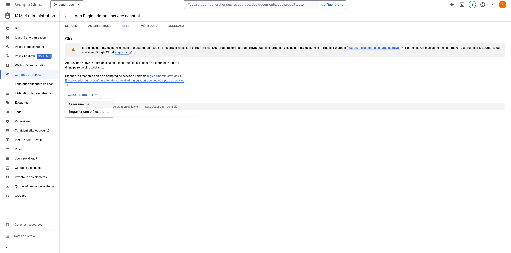
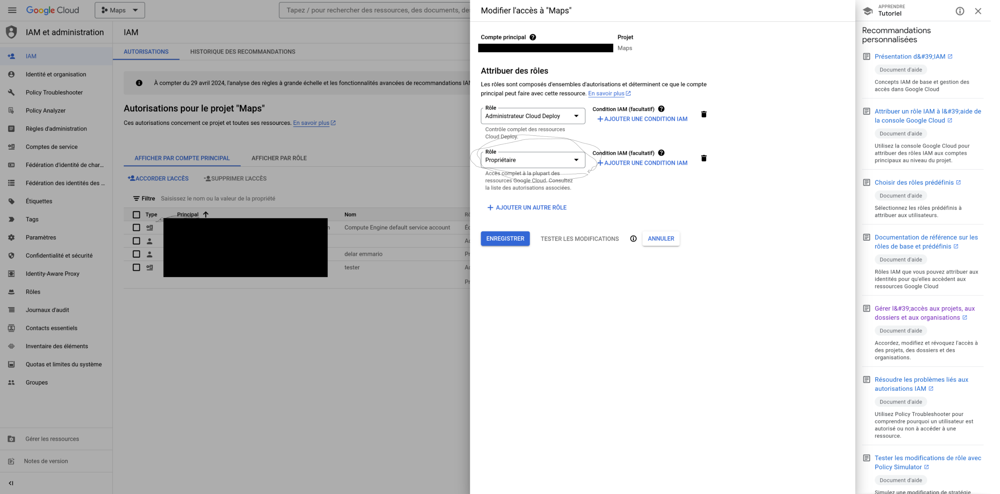

# Comment activer les permissions et récupérer votre clé d'accès API

# Créer un compte de service

Un compte de service sur Google Cloud Platform (GCP) est un compte spécifique conçu pour permettre à une application ou à un processus d'accéder aux ressources de Google Cloud sans utiliser les identifiants d'un utilisateur humain. Cela simplifie l'accès aux fonctionnalités de Google Cloud, telles que la gestion des machines virtuelles ou l'accès aux bases de données, sans avoir à partager les informations d'identification d'un utilisateur.

1. Connectez-vous à la console de Google Cloud.
2. Dans la barre de recherche, saisissez "IAM" et sélectionnez le service correspondant.
3. Accédez à la section "Comptes de service" dans le menu de gauche.
4. Créez un nouveau compte de service.
5. Une fois le compte créé, cliquez dessus (sur l'adresse e-mail associée au nouveau compte) et activez-le en cliquant sur le bouton prévu à cet effet (Activé votre compte de service).

[Doc google sur la creation d'un compte de service](https://cloud.google.com/iam/docs/service-accounts-create)

# Récupérer la clé API (my-account.json)

Dans la section "Clés" de votre compte de service, générez une clé d'API au format JSON. En cliquant sur "Ajouter une clé".
Placez cette clé dans le répertoire racine de votre projet dans le repertoire gcp. Par défaut, la clé doit être stockée dans "./gcp/account/my-account.json" pour chaque fichier de projet (Iaas, Faas, Caas, Paas, Saas).

# Permissions

Les permissions définissent les actions que votre compte de service est autorisé à effectuer sur les ressources de Google Cloud. Pour déployer des applications sur le cloud via des outils tels qu'Ansible ou gcloud CLI, vous devez accorder les autorisations nécessaires à votre compte de service.

Toujours dans la section "IAM et administration", sélectionnez votre compte de service dans la liste des comptes.
Sous "Rôles", vous trouverez l'option "Attribuer des rôles". Cliquez dessus.
Ajoutez un rôle en cliquant sur "Ajouter un rôle".
Sélectionnez le rôle "Propriétaire" dans la catégorie "Instance de base" et attribuez-le à votre compte de service.

[En savoir plus sur les roles GCP](https://cloud.google.com/iam/docs/roles-overview?hl=fr)

Dans cette image, les adresses e-mail associées à votre compte sont dissimulées dans un cadre noir. Vous devrez choisir de mettre à jour les comptes de service qui utilisent la clé API afin qu'ils puissent négocier les droits d'accès à l'API distante de votre service cloud.