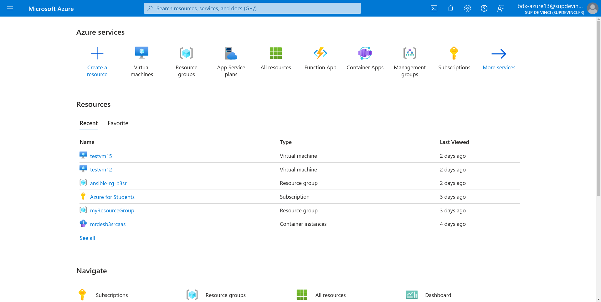
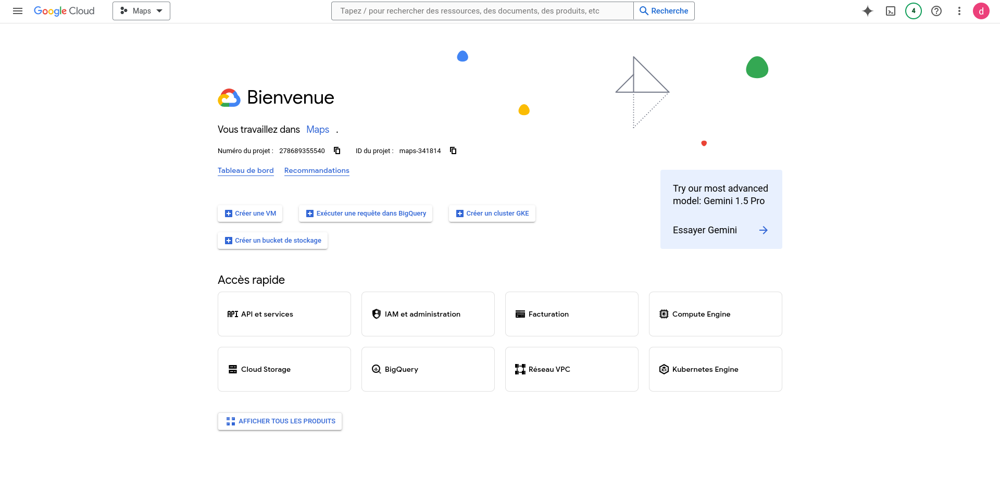
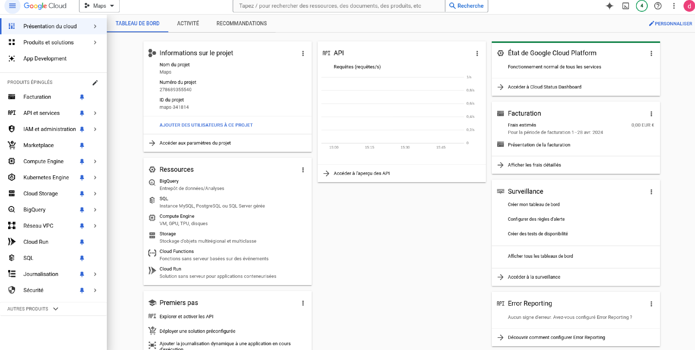

# Cloud: Interface Utilisateur

## Découverte de l'Interface Utilisateur Azure

L'interface utilisateur Azure offre une plateforme conviviale pour gérer vos ressources cloud. Chaque service proposé par Azure devient disponible en tant que ressource uniquement une fois déployé. Vous pouvez naviguer à travers les différentes sections telles que les ressources, les groupes de ressources, les abonnements et les services pour visualiser, déployer et gérer efficacement vos applications et infrastructures. Grâce à son interface intuitive, vous pouvez facilement surveiller les performances, configurer les paramètres et tirer parti des fonctionnalités avancées pour optimiser votre environnement cloud.

  

## Exploration de l'Interface Utilisateur Google Cloud Platform (GCP)

L'interface utilisateur de Google Cloud Platform (GCP) offre une expérience fluide et intuitive pour gérer vos services cloud. Vous pouvez accéder à une gamme complète de fonctionnalités à partir d'un tableau de bord centralisé, y compris la création et la gestion de vos projets, la surveillance des ressources, le déploiement d'instances, le stockage des données et bien plus encore. Avec une navigation claire et des outils intégrés, l'interface utilisateur GCP facilite la configuration, la gestion et l'optimisation de votre infrastructure cloud, vous permettant de tirer pleinement parti des capacités de Google Cloud pour vos applications et charges de travail.

La première illustration vous donne un aperçu global de tous les services disponibles, tandis que la seconde vous présente un tableau de bord détaillé où vous pouvez visualiser vos ressources actives et en instancier de nouvelles:

    
    

